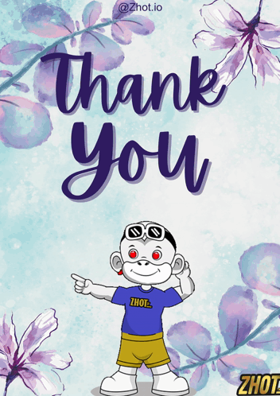

# Projeto Landing Page pelo curso DevQuest Dev em Dobro

Este foi meu primeiro projeto de Landing Page 🚀 

<div align="center">  
    <h2 style="color: darkgoldenrod">Agência XYZ</h2>
    <h3 >Preview</h3>


</div>

## Tecnologias utilizadas:

<div align="center" >
    <figure style="display: flex; justify-content: space-around; text-align:center; align-items: center;">
        
        
    </figure>
</div>

Utilizando as técnicas de Grid e Flex para marcar e criar uma boa estrutura da página. 

Usando técnicas para responsivo mobile e tablet.


## Desafios 🦾🙅🏻‍♀️:


### - Animação da seta ⬇️ no CSS

```css
.hero:after {
    content: url('../images/seta_preta.png');
    position: absolute;
    height: 35px;
    bottom: 40px;
    animation: downarrow 0.6s infinite alternate ease-in-out;
}

@-webkit-keyframes downarrow {
    0% { -webkit-transform: translate(0); opacity: 0.4; }
    100% { -webkit-transform: translateY(0.4em); opacity: 0.9; }
}
```

### - Menu hamburger para dispositivos mobile e tablet

Aqui foi um desafio muito enriquecedor, acrescentar esse menu foi algo super satisfatório e empolgante para os próximos projetos 👌

```css
.header .hamburger {
    background-color: #000;
    position: relative;
    display: block;
    width: 30px;
    height: 2px;
    top: 29px;
    left: 15px;
    transition: 0.5s ease-in-out;
}

.header .hamburger::before, 
.header .hamburger::after {
    background-color: #000;
    content: "";
    display: block;
    width: 100%;
    height: 100%;
    position: absolute;
    transition: 0.7s ease-in-out;
}

.header .hamburger::before {
    top: 10px;
}

.header .hamburger::after {
    bottom: 10px;
}

.header input {
    display: none;
}

.header input:checked ~ label .hamburger {
    transform: rotate(45deg);
}

.header input:checked ~ label .hamburger::before {
    transform: rotate(90deg);
    top: 0;
}

.header input:checked ~ label .hamburger::after {
    transform: rotate(90deg);
    bottom: 0;
}
```

## Responsividade em várias telas

- Responsivo para mobile e tablet

<div align="center">


</div>

## Experiência

Adiquiri bastante experiência e aprimoramento das minhas habilidades básicas de marcação, estilização e primeira animação utilizando CSS 😎 principalmente a animação da seta sem utilizar JS e o menu hamburger para versões mobile e tablet.

## Agradecimentos

<p>Dedico toda minha gratidão aos gêmeos e toda equipe do <span style="color: rgb(125, 25, 218);">DevQuest Dev em Dobro</span> por me proporcionar essa experiência e aprendizagem incrível que estou adiquirindo ao longo do curso.</p>


<div align="center">



</div>